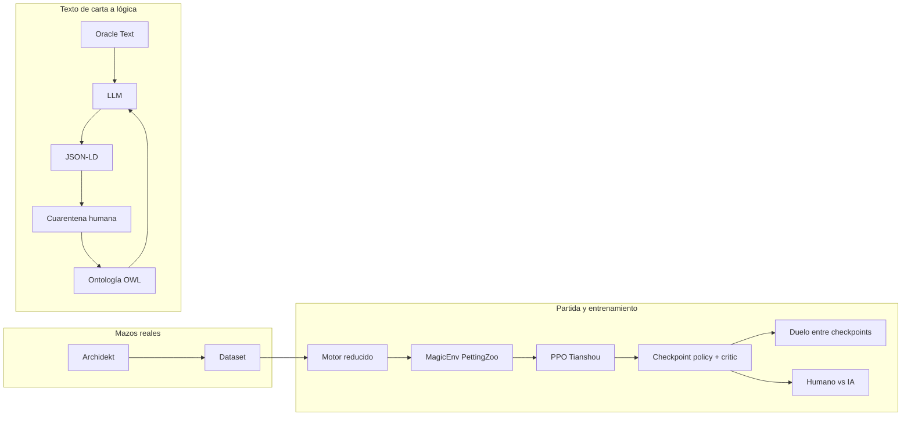
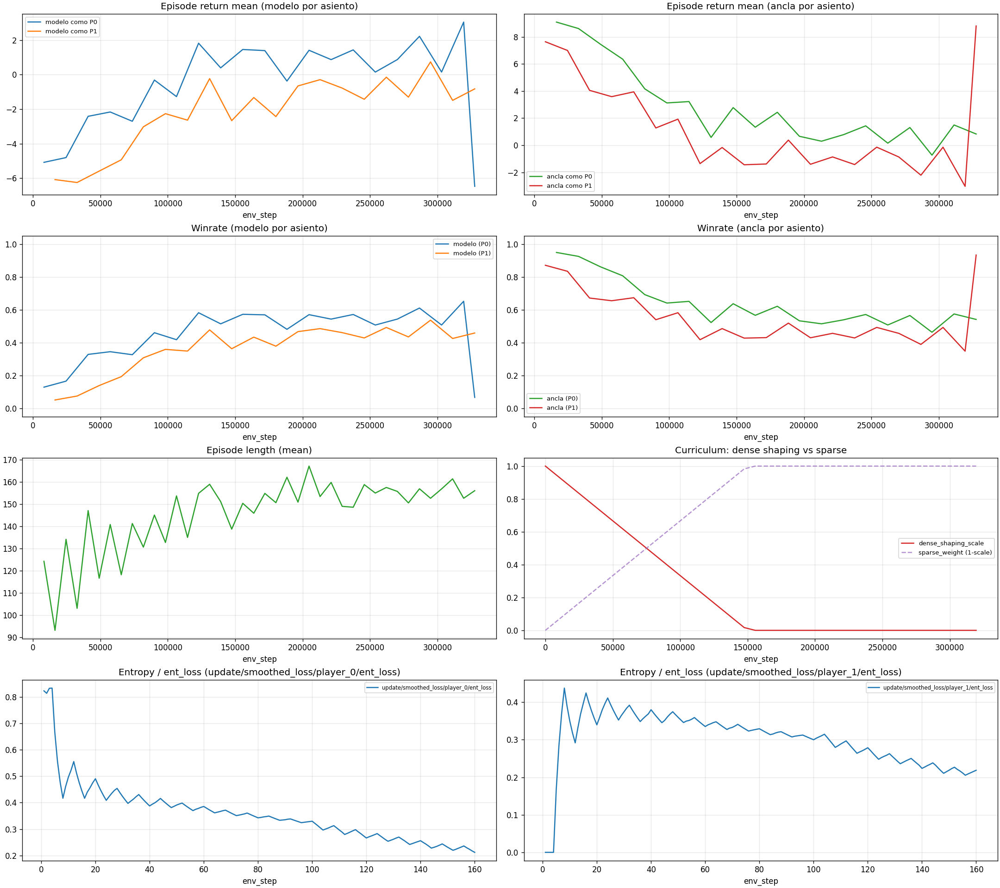

# Motor reducido de Magic para aprendizaje por refuerzo

Prototipo de Trabajo de Fin de Grado: un motor simplificado de *Magic: The Gathering* expuesto como entorno multiagente, con entrenamiento PPO, evaluación reproducible y un pipeline aparte que traduce el texto de las cartas a una representación formal (OWL + JSON-LD).

El reglamento completo del juego es demasiado grande para usarlo como primer banco de pruebas. Si un agente no aprende, no se puede saber si falla la red o el motor. Este repositorio fija primero un subconjunto jugable —robar, jugar tierras, invocar criaturas y resolver combate— y construye encima el ciclo completo de experimentación: entrenar, registrar, comparar políticas y revisar el comportamiento a mano.

---

## Qué incluye

Dos líneas de trabajo, independientes entre sí.

**Entorno y agentes.** Partidas 1v1 sobre el motor reducido, observación numérica fija, enmascaramiento de acciones ilegales y políticas entrenadas con PPO (Tianshou). Hay self-play, reanudación desde un checkpoint, entrenamiento contra un oponente congelado y tres señales de recompensa: densa, escasa y curriculum (el shaping denso se apaga de forma lineal).

**Representación de cartas.** Un CLI traduce Oracle Text a JSON-LD. La ontología OWL es el vocabulario permitido. Si el modelo necesita un concepto que no existe, la carta entra en cuarentena y una revisión humana acepta, rechaza o corrige cada propuesta antes de escribirla en el OWL y en el JSON operativo.

Los mazos públicos de Archidekt pueden alimentar el motor, pero solo entran tierras y criaturas. El JSON-LD no se ejecuta todavía dentro de la partida: es la representación intermedia para un motor de reglas más amplio.

---

## Arquitectura



| Pieza | Papel |
| --- | --- |
| `motor_prueba/motor.py` | Turnos, fases, acciones legales, combate y recompensa |
| `motor_prueba/env_magic.py` | Entorno AEC de PettingZoo. Observación de 124 valores y máscara sobre 50 acciones |
| `motor_prueba/train.py` | Entrenamiento PPO, logs y checkpoints |
| `motor_prueba/train_modes.py` | Curriculum, warm-start y oponente congelado |
| `motor_prueba/deck_loader.py` | Mazos de Archidekt reducidos a tierras y criaturas |
| `traduccion/agente_mtg_cli.py` | Oracle Text a JSON-LD, cuarentena y validación |
| `traduccion/ontology_store.py` | OWL como fuente de verdad y exportación a JSON |
| `IA_OWL/OWL_tfg.rdf` | Ontología editable en Protégé |
| `IA_JSON/ontologia_motor.json` | Diccionario operativo que consume el prompt y el validador |

La red es un backbone de dos capas de 128 unidades. El actor sale a 50 acciones discretas y el crítico a un escalar. Una política propia multiplica las probabilidades del actor por la máscara y renormaliza, de modo que una jugada ilegal tiene probabilidad cero.

---

## Decisiones que sostienen el prototipo

**Máscara de acciones de verdad.** El entorno devuelve `observation` y `action_mask`. La máscara llega hasta el muestreo de la política, no se queda en un filtro posterior. El log cuenta además los intentos inválidos, para poder comparar un entreno con máscara y otro sin ella (`--disable-mask`).

**Recompensa como variable experimental.** La señal terminal es siempre +10 / −10. El modo denso suma premios pequeños por jugar una carta, declarar atacantes o bloqueadores y por el daño infligido. El modo escaso deja solo el resultado final. El curriculum empieza en denso y lleva la escala de esos premios a cero. Así se puede estudiar el shaping sin cambiar el código entre runs.

**Métrica que no miente en un juego de suma cero.** La media de (+10, −10) es 0 aunque haya un ganador claro. En modo escaso, y cuando el curriculum ya está cerca de escaso, el reward de test usa la media del valor absoluto por episodio.

**Trazabilidad ligera.** Cada run escribe un JSONL con pasos, fin de episodio y metadatos de época, escalares en TensorBoard y una línea en `logs/runs_manifest.jsonl` con hiperparámetros, semilla, dataset y rutas. El checkpoint guarda actor y crítico (`magic_policy_critic_v1`) y no pisa un fichero ya existente.

**Self-play y una línea base fija.** Warm-start continúa una política en self-play. El modo ancla enfrenta al aprendiz con una copia congelada (`FrozenPPO`, sin gradiente) y puede intercambiar asientos para no confundir “mejor política” con “ventaja de ir primero”.

**Traducción con tres contratos alineados.** El OWL dice qué conceptos existen, el prompt obliga al modelo a usarlos y un validador Python comprueba el JSON después de la llamada. Las condiciones y las cantidades son composición de primitivas (`COMPARISON`, conteos, referencias a atributos), para no inventar una constante nueva por cada carta.

---

## Qué muestra un entreno

La figura es el run `anchor_curriculum_sparse2`. Una política aprende con PPO contra una copia congelada, las dos cambian de asiento en cada época, y el shaping denso baja en línea recta hasta desaparecer hacia el paso 150 000. Desde ahí la señal ya es solo la terminal.



- **Winrate.** Quien aprende pasa de cerca de 0,1–0,2 a cerca de 0,5–0,6, según el asiento. La ancla, con los pesos fijos, baja de cerca de 0,9 hacia 0,5. La curva de quien juega como P0 queda por encima: el orden de turno sigue pesando.
- **Curriculum.** `dense_shaping_scale` llega a 0 alrededor del paso 150 000. A partir de ese punto los premios intermedios ya no empujan.
- **Longitud.** Las partidas se alargan y se estabilizan en torno a 150–160 pasos.
- **Entropía.** Las dos políticas se vuelven más deterministas a lo largo del entreno.

El último punto de varias curvas se separa del tramo anterior. Con un cambio de asiento en cada época, esa cola no cambia la lectura del resto del run.

El otro resultado es un duelo directo, ya sin entrenar: 50 partidas con intercambio de asiento, misma máscara y mismo límite de pasos. El checkpoint de recompensa escasa ganó 36 a 14 al de recompensa densa, sin partidas truncadas. En este motor y con ese protocolo, la política entrenada solo con la señal terminal quedó por delante. Hace falta variar semillas, duración y arquitectura antes de tomarlo como un resultado general sobre reward shaping.

En el repositorio queda esta figura. Los JSONL y los `.pth` se regeneran al entrenar.

---

## Stack

Python 3.10+ (recomendado 3.11).

| Uso | Librerías |
| --- | --- |
| Entorno y entrenamiento | PyTorch, Tianshou, PettingZoo, Gymnasium, NumPy |
| Registro y gráficas | TensorBoard, Matplotlib |
| Mazos públicos | `requests`, `pyedhrec` |
| Traducción | `litellm`, `rdflib` |
| Grafo de la red (opcional) | `torchviz` y el binario Graphviz |

El módulo de traducción llama a la API de PoliGPT (UPV). La clave va en `POLIGPT_API_KEY` y no se versiona.

---

## Puesta en marcha

Desde la raíz del repositorio, en PowerShell:

```powershell
python -m venv .venv
.\.venv\Scripts\Activate.ps1
python -m pip install --upgrade pip
pip install torch tianshou pettingzoo gymnasium numpy requests matplotlib tensorboard pyedhrec
```

En bash la activación es `source .venv/bin/activate`. Si hay GPU CUDA, instala PyTorch con la matriz oficial de tu versión de CUDA.

Los scripts de `motor_prueba/` usan rutas relativas a esa carpeta. Entra en ella antes de entrenar:

```powershell
Set-Location .\motor_prueba
python .\train.py --run-name demo --max-epochs 5 --epoch-steps 2000 --reward-mode sparse
python .\visualize_training.py demo --metric reward --x time --out .\logs\plots\demo_reward.png
python .\play_human_vs_ai.py --ckpt .\modelos\demo_policy.pth --human-seat p0
```

Si el checkpoint sale con sufijo (`demo_policy_2.pth`), usa el nombre que imprime `train.py` al terminar. Sin dataset, cada jugador recibe un mazo de prueba: 20 tierras y 20 criaturas 2/2.

Comprobar el entorno sin entrenar:

```powershell
python .\test_env.py
```

---

## Entrenar y comparar

```powershell
# Self-play con shaping denso
python .\train.py --run-name dense_01 --max-epochs 30 --epoch-steps 5000 --test-episodes 10 --reward-mode dense

# Solo señal terminal
python .\train.py --run-name sparse_01 --reward-mode sparse --max-episode-steps 400

# Shaping que se apaga
python .\train.py --run-name curr_01 --reward-mode curriculum --curriculum-steps 150000

# Continuar una política
python .\train.py --run-name warm_01 --warm-start .\modelos\sparse_01_policy.pth

# Aprender contra un oponente fijo, alternando asiento
python .\train.py --run-name anchor_01 --anchor-checkpoint .\modelos\sparse_01_policy.pth --anchor-seat p0 --anchor-swap-epochs 5

# 50 partidas entre dos checkpoints, cambiando quién sale
python .\match_checkpoints.py --p0-ckpt .\modelos\sparse_01_policy.pth --p1-ckpt .\modelos\dense_01_policy.pth --games 50 --swap
```

Flags que más cambian el experimento: `--reward-mode {dense,sparse,curriculum}`, `--disable-mask`, `--lr`, `--eps-clip`, `--entropy-coef`, `--seed`, `--max-episode-steps`, `--dataset-path`. Warm-start y ancla no se combinan.

Cada run deja:

- `logs/<run>.jsonl`
- `logs/tb/<run>/`
- `modelos/<run>_policy.pth` (o el sufijo que toque si el nombre ya existía)
- una línea en `logs/runs_manifest.jsonl`

TensorBoard, desde la raíz del repo:

```powershell
tensorboard --logdir .\motor_prueba\logs\tb
```

Panel de un run (reward, acciones inválidas, longitud, winrate y, si aplica, la curva del curriculum):

```powershell
python .\visualize_training.py demo --dashboard --out .\logs\plots\demo_dashboard.png
```

`--episode-env test` separa los episodios de evaluación de los de recolección. `--reward-source` elige la curva agregada de TensorBoard o la traza por paso del JSONL: miden cosas distintas.

<details>
<summary>Más comandos: logs, red, mazos y traducción</summary>

Análisis rápido de un JSONL:

```powershell
python .\analyze_logs.py .\logs\demo.jsonl
```

Grafo del actor y del crítico (hace falta Graphviz instalado en el sistema):

```powershell
pip install torchviz graphviz
python .\visualize_network.py --which both --out-dir .\logs\net_graphs --device cpu
```

Dataset de mazos para un comandante, desde la raíz del repo:

```powershell
python .\ingesta_datos\test_archidekt.py
```

El JSON resultante se ignora en git por tamaño. Para entrenar con él:

```powershell
Set-Location .\motor_prueba
python .\train.py --run-name run_dataset --dataset-path ..\ingesta_datos\dataset_valgavoth_arquitectura_ia.json --reward-mode curriculum --curriculum-steps 150000
```

Otros scripts de ingesta, también desde la raíz:

- `ingesta_datos/fetch_archidekt_by_cardname.py` — JSON por carta e índice.
- `ingesta_datos/test_edhrec.py` — comprobación de respuesta de EDHREC.
- `ingesta_datos/prueba.py` — volcado bruto de un mazo por id (hay que editar `ID_DEL_MAZO`).

Traducción de una carta. Hace falta clave y, la primera vez, `litellm` y `rdflib`:

```powershell
pip install litellm rdflib
$env:POLIGPT_API_KEY = "sk-..."
python .\traduccion\agente_mtg_cli.py
```

En CMD: `set POLIGPT_API_KEY=sk-...`. En bash: `export POLIGPT_API_KEY="sk-..."`.

Durante la cuarentena, cada propuesta se revisa sola: `Y` la escribe en el OWL y en el JSON, `N` la descarta, `C` pide una corrección y vuelve a traducir.

</details>

---

## Alcance de este código

El motor juega un Magic reducido: tierras que producen un maná genérico, criaturas con fuerza y resistencia, y combate directo con bloqueo. No hay pila, instantáneos, habilidades activadas ni el reglamento completo.

La observación cabe en 124 números y el menú de acciones está fijado en 50. Eso alcanza para el prototipo y habría que reabrirlo si el estado del tablero crece.

La traducción y el motor comparten el dominio, no el runtime. El CLI produce y valida JSON-LD; la partida sigue construyendo objetos `Land` y `Creature`.

---

## Autor

Mario Merino Martín. Código del Trabajo de Fin de Grado.
